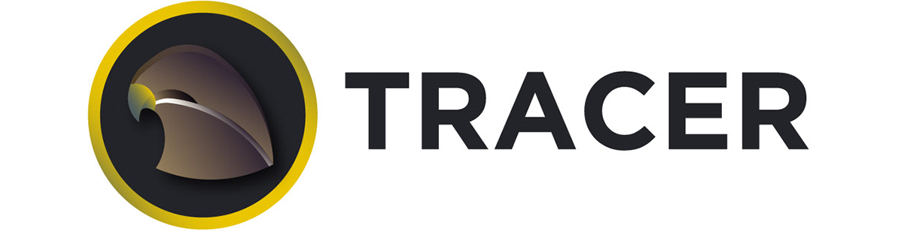

# SportTracer

Live sport scores website. Developed as a project at SofaScore Academy 2021.  

### Available sports:

- football :soccer:
- basketball :basketball:
- rugby :football:

### Visit website:
> ___https://sport-tracer.vercel.app___ :link:

## App Development

_CRA_ React app using _React Router_.

### Setup

Clone the repository:

``> git clone https://github.com/ftodoric/sport-tracer & cd sport-tracer``

Run app at _http://localhost:3000_ in development mode:

``> npm start``  
  
or using Yarn package manager:
  
``> yarn start``

### Backend
Data is provided from **SofaScore API**.

### Deployment
Deployed on **Vercel** domain.

  

**Creator**: ftodoric  
**Start date**: 31/05/2021
